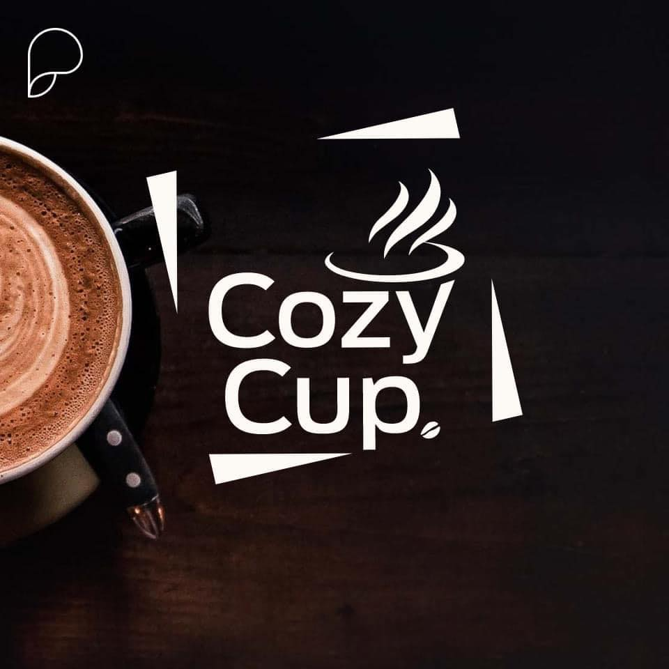
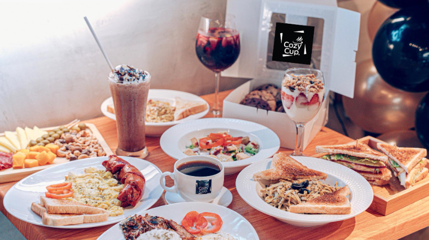
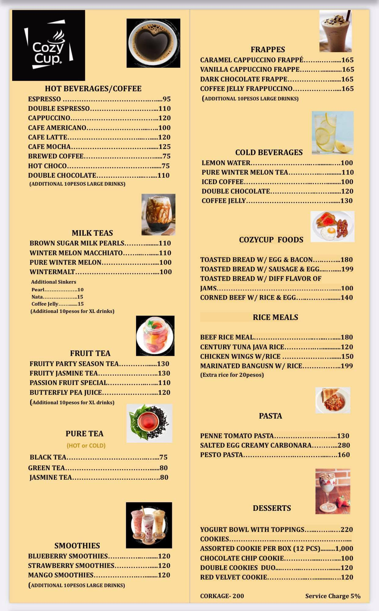
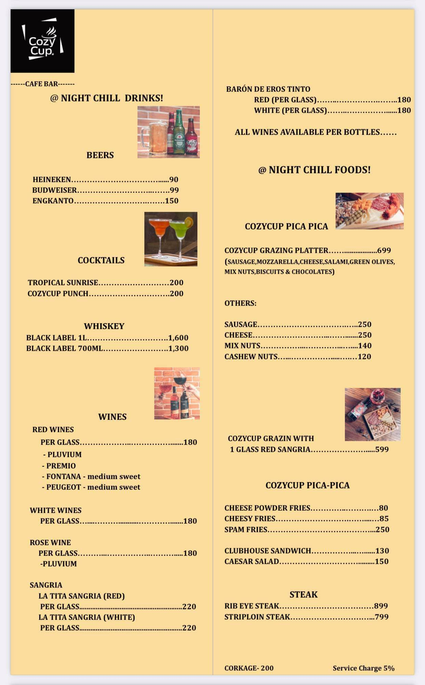

Cozy Cup Cafe
***

# Project Description
Cozy Cup Cafe is a Coffee shop that serve variety of drinks and pastries.

### Features
- Hot Beverages
-  Milk Teas
-  Fruit Tea
-  Pure Tea
-  Smoothies
-  Frappes
-  Cold Beverages
-  CozyCup's Food
-  Rice Mea
-  Pastas
-  Dessert
-  
### Screen Captures

   

<ul>
  <li>Our Logo that you can see in our signage and our fb porfile that you can see if you <a href = "https://www.facebook.com/cozycup.com.ph">Click Here!</a>.</li>
  <li>Our oover photp for our shop</li>
  <li>Our Menu</li>
  <li>Another page of our menu</li>
</ul>

<h3>About the authors</h3>

<b>Name:</b> Jetro C. Selda

<b>Email:</b> jetroselda75@gmail.com

       

